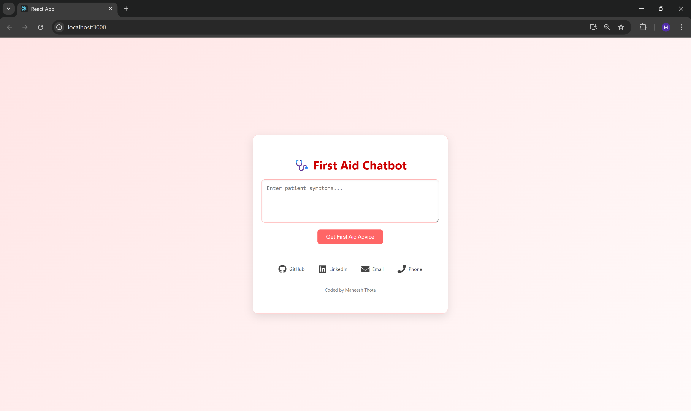
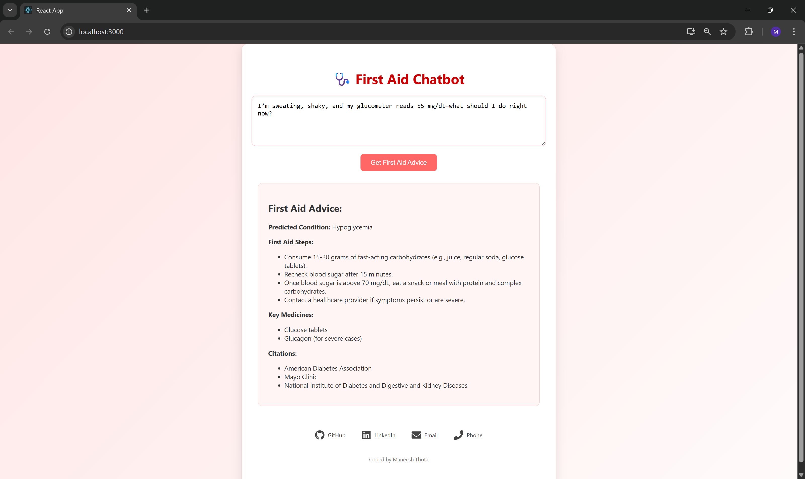
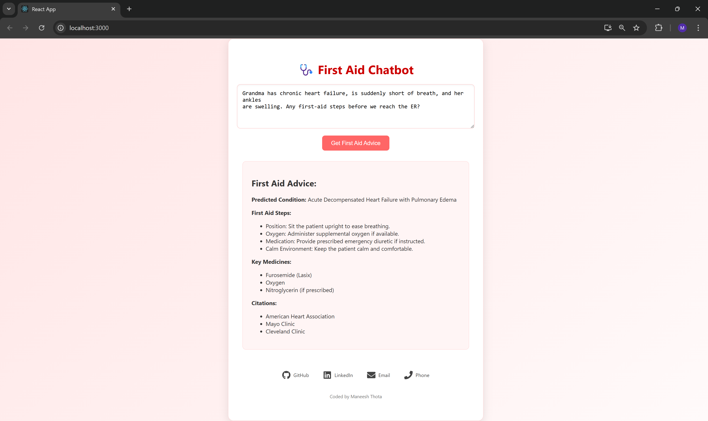

# RAG-Powered First-Aid Chatbot

A Retrieval-Augmented Generation (RAG) chatbot providing first-aid advice for **Diabetes**, **Cardiac**, and **Renal** emergencies. Combines structured medical knowledge with live web data to deliver safe, evidence-based responses.

## Features

- 🔎 **Hybrid Retrieval**: Integrates local semantic search (ChromaDB + OpenAI embeddings) with real-time web search (Serper.dev).
- 🤖 **Condition Inference**: Classifies medical conditions from free-text symptom descriptions across three domains.
- 💡 **Answer Generation**: Provides ~250-word first-aid responses, including condition details, first-aid steps, key medications, and citations.
- ⚙️ **FastAPI Backend**: Lightweight, real-time API for seamless inference.
- 🧪 **Testing Suite**: Comprehensive unit tests using pytest.

## Setup Instructions

1. **Clone the Repository**:

   ```bash
   git clone https://github.com/maneesxh/RAG-FirstAid-Chatbot.git
   cd RAG-FirstAid-Chatbot
   ```

2. **Install Backend Dependencies**:

   ```bash
   cd backend
   pip install -r requirements.txt
   ```

3. **Set API Keys**:
   Create a `.env` file in the root directory:

   ```bash
   OPENAI_API_KEY=your-openai-key
   SERPER_API_KEY=your-serper-key
   ```

4. **Ingest Corpus** (run once):

   ```bash
   python ingest.py
   ```

5. **Run Backend Server**:
   Navigate to the backend folder and start the server:

   ```bash
   uvicorn src.main:app --reload
   ```

6. **Run Frontend**:
   In a new terminal, navigate to the frontend folder and start the frontend:

   ```bash
   cd frontend
   npm install
   npm start
   ```

7. **Run Tests** (optional):
   From the root directory, run the test suite:

   ```bash
   pytest tests/
   ```

## Usage

- Access the backend API at `http://localhost:8000` after starting the server.
- Access the frontend at `http://localhost:3000` (or the port specified by npm).
- Input symptoms via the frontend or API to receive tailored first-aid advice.
- Ensure API keys for OpenAI and Serper.dev are valid to enable retrieval and generation.

## Contributing

Contributions are welcome! Please submit a pull request or open an issue for suggestions or bug reports.

## Author

Maneesh – [LinkedIn](https://www.linkedin.com/in/maneeshthota/) | thotamaneesh@gmail.com

## Images

Below are screenshots of the chatbot's user interface and sample interactions:






